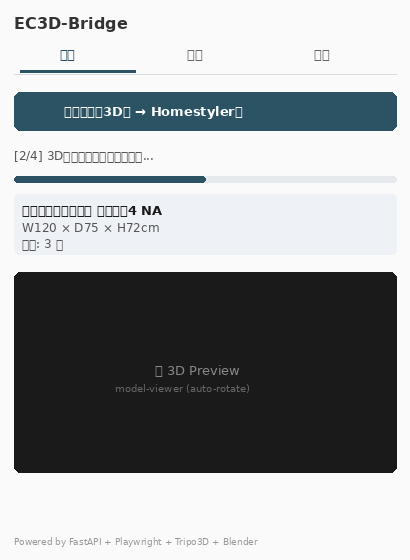
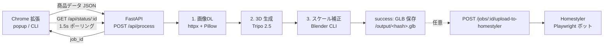

# EC3D-Bridge

[](https://github.com/5newold111/furniture-3D-modeling-/actions/workflows/test.yml)


ECサイトの商品ページから家具情報を抽出し、自動で 3D モデル化して Homestyler に登録する Chrome 拡張機能 + バックエンドです。



機能ハイライト:
- **単発投入** — 開いている商品ページからワンクリックで 3D 化
- **一括投入** — 複数URLを行区切り入力し順次バックグラウンド処理
- **ジョブ履歴** — 過去ジョブを popup から確認
- **3D プレビュー** — 完了時に `<model-viewer>` で表示
- **構造化エラー** — 失敗時に対処ガイドを画面に表示

## アーキテクチャ (v2.0)



**v2.0 の重要設計判断**: Homestyler アップロードはコアパイプラインから分離されました。GLB 生成までが「コア」(成功すれば必ず手元に GLB が残る)、Homestyler は明示的に呼ぶオプショナル後処理です。Tripo クレジットを消費して生成した結果が Homestyler の不調で失われない設計になっています。

| ステップ | 実装 | 失敗時の挙動 |
|---|---|---|
| 1. 画像DL | `services/image_downloader.py` | 400px 未満や 404 をスキップして次の画像へ |
| 2. 3D生成 | `services/model_generator.py` | fal.ai Tripo 2.5 API。SHA-256 でキャッシュ |
| 3. スケール補正 | `scripts/scale_model.py` (Blender) | 寸法 0 ならスキップして原本を返す |
| (任意) Homestyler | `services/homestyler_bot.py` | 別ジョブとして起動。失敗してもコアの GLB は保持 |

> **3D 生成プロバイダーについて**
> 当初 TRELLIS 2 (HuggingFace) / Tripo (fal.ai) の二択構成でしたが、TRELLIS 2 は HF Inference API では提供されておらず (Gradio Space のみ)、Tripo 一本化しました。HF Inference 経由で TRELLIS を再導入する場合は [microsoft/TRELLIS のリポジトリ](https://huggingface.co/microsoft/TRELLIS) の最新提供形態を確認してください。

> **Homestyler 連携の制約**
> Homestyler には公式 API がなく、Playwright によるブラウザ自動操作で対応しています。実環境では reCAPTCHA や Google OAuth 認証が挟まる可能性があり、`extension/services/homestyler_bot.py` の `SELECTORS` は推測値です。本番運用前に必ず後述の [Homestyler セレクター検証手順](#homestyler-セレクター検証手順) を実施してください。

## クイックスタート

### 1. バックエンド (ローカル実行)

```bash
cd backend
cp .env.example .env   # トークン類を埋める
pip install -r requirements.txt
python -m playwright install chromium
uvicorn main:app --host 0.0.0.0 --port 3000 --reload
```

### 1-alt. バックエンド (Docker Compose)

```bash
cp backend/.env.example .env   # ルート直下の .env を Compose が読み込む
docker compose up --build
```

Blender + Playwright Chromium を含むイメージのため初回ビルドは ~2.5GB / 数分かかります。`docker-compose.yml` は `JOB_DB_PATH=/data/jobs.db` を named volume にマウントするのでコンテナ再起動でジョブ履歴が消えません。

`http://localhost:3000/health` で `{"status":"ok"}` が返れば起動成功。
依存コンポーネント (Blender / HF or fal.ai / Homestyler) の詳細状態は `/health/detail` で確認できます。

### 2. Chrome 拡張機能

1. `chrome://extensions/` を開く
2. 「デベロッパーモード」をON
3. 「パッケージ化されていない拡張機能を読み込む」→ `extension/` を選択

### 3. 使い方 (拡張機能)

対応 EC サイト (ニトリ・IKEA・MUJI・Amazon JP・楽天・ロウヤ・カインズ・大塚家具) の商品ページを開いて拡張機能アイコンをクリック → 「この商品を3D化」。
進捗バーが 3 ステップを表示し、完了すると 3D プレビューが popup に表示されます。**Homestyler に登録したい場合のみ**、別ボタン「Homestylerにアップロード (任意)」を押下。

同じ画像で再実行した場合、SHA-256 ハッシュをキーとした GLB キャッシュ (`output/<hash>_raw.glb`) がヒットし、Tripo API は呼ばれません (クレジット節約)。

### 3-alt. 使い方 (CLI)

拡張機能を使わずターミナルから操作:

```bash
cd backend
# 1 件投入 + 完了まで待つ
python scripts/ec3d_cli.py submit product.json --wait
# 直近ジョブ一覧
python scripts/ec3d_cli.py jobs
# 成功ジョブを Homestyler に流す
python scripts/ec3d_cli.py upload-homestyler <job_id> --wait
# 実行中ジョブをキャンセル
python scripts/ec3d_cli.py cancel <job_id>
```

`EC3D_API_URL` / `EC3D_API_KEY` 環境変数でリモートバックエンドや認証ヘッダにも対応します。

## 設定 (`.env`)

| 変数 | 説明 |
|---|---|
| `FAL_API_KEY` | fal.ai API キー (Tripo 2.5 利用) — [fal.ai](https://fal.ai/) で発行 |
| `HOMESTYLER_EMAIL` / `HOMESTYLER_PASSWORD` | Homestyler ログイン認証情報 |
| `BLENDER_PATH` | Blender 実行ファイルへの絶対パス (default: `blender`) |
| `PORT` | サーバーポート (default: `3000`) |
| `JOB_DB_PATH` | SQLite ジョブDBのパス (default: `jobs.db`) |
| `HOMESTYLER_MAX_CONCURRENCY` | Playwright 同時起動上限 (default: `1`) |
| `EC3D_API_KEY` | 設定すると `X-API-Key` ヘッダ必須化 (空なら認証無効) |
| `RATE_LIMIT_BURST` | `/api/process` の単一IPあたりバースト上限 (default: `10`) |
| `RATE_LIMIT_PER_SEC` | バケットのリフィル速度 [req/s] (default: `0.5`) |
| `LOG_FORMAT` | `json` で構造化ログ出力、それ以外はテキスト (default: `text`) |
| `LOG_LEVEL` | `INFO` / `DEBUG` 等 (default: `INFO`) |

## セキュリティ: CORS

バックエンドの CORS は以下のオリジンのみ許可します:

- `chrome-extension://<ID>` — 拡張機能本体
- `http(s)://localhost(:port)?` / `http(s)://127.0.0.1(:port)?` — ローカル開発用

それ以外の Web サイトから `fetch("http://localhost:3000/...")` した場合は CORS で拒否されます (`tests/test_cors.py` で検証済み)。

## API

| メソッド | パス | 説明 |
|---|---|---|
| `GET` | `/health` | 軽量ヘルスチェック (常に 200) |
| `GET` | `/health/detail` | Blender / モデルプロバイダー / Homestyler の設定状態を返す |
| `POST` | `/api/process` | ジョブを作成し `{job_id}` を 202 で返す |
| `GET` | `/api/status/{job_id}` | ジョブの進捗・結果・エラーを返す |
| `GET` | `/api/jobs?limit=N` | 直近のジョブ一覧を created_at 降順で返す (1≤N≤500) |
| `POST` | `/api/jobs/{job_id}/cancel` | 実行中ジョブにキャンセル要求を送る (次の境界で停止) |
| `POST` | `/api/jobs/{job_id}/upload-to-homestyler` | 成功済みジョブの GLB を Homestyler に流す (オプショナル後処理) |
| `GET` | `/api/errors/guidance` | error_code → ユーザー向け対処メッセージの辞書 |
| `GET` | `/output/{filename}` | 生成済み GLB の静的配信 (3D プレビュー用) |

OpenAPI 仕様は [`docs/openapi.json`](./docs/openapi.json) にスナップショット済み (CI でドリフトを検出)。バックエンド起動中は Swagger UI が `http://localhost:3000/docs` で参照できます。

### `POST /api/process` リクエスト例

```json
{
  "product_name": "ダイニングテーブル ノーチェ4",
  "source_url": "https://www.nitori-net.jp/ec/product/8120164/",
  "site": "nitori-net.jp",
  "dimensions": { "width_cm": 120, "depth_cm": 75, "height_cm": 72 },
  "colors": ["ナチュラル"],
  "materials": ["天然木", "オーク"],
  "images": [{ "url": "https://...", "type": "front" }],
  "category": "家具"
}
```

### `GET /api/status/{job_id}` レスポンス例

```json
{
  "id": "f774fdc1a99b",
  "product_name": "ダイニングテーブル ノーチェ4",
  "status": "running",
  "step": "generating_3d",
  "step_index": 2,
  "total_steps": 4,
  "message": "[2/4] 3Dモデルを生成しています...",
  "result": null,
  "error": null
}
```

`status` は `queued` / `running` / `success` / `error` のいずれか。
終端状態 (`success`/`error`) に達するまで popup は 1.5 秒間隔でポーリングします。

## 開発

### テスト

```bash
# バックエンド (pytest, 80テスト + カバレッジ)
cd backend
pip install -r requirements-dev.txt
pytest tests/ --cov --cov-report=term-missing

# 拡張機能 (node --test, 20テスト)
cd extension
npm install
npm test
```

`just` をインストール済みなら `just test` で両方走らせられます。他にも `just lint` / `just fmt` / `just serve` / `just openapi` などが定義されています (`just --list` を参照)。

### OpenAPI スキーマ更新

API を変更したら `docs/openapi.json` を再生成してコミット:

```bash
cd backend
python scripts/dump_openapi.py
git add ../docs/openapi.json
```

CI の `openapi-snapshot` ジョブで差分を検出します。

CI (GitHub Actions) は PR ごとに上記を自動実行します。

### コードスタイル (pre-commit)

```bash
pip install pre-commit
pre-commit install
```

`.pre-commit-config.yaml` で ruff (Python lint+format)、prettier (JS/JSON/HTML/MD)、`detect-private-key` などのフックが有効になります。コミット時に自動チェック+整形されます。

### サイト追加 / セレクター修正

商品ページの HTML 構造が変わった場合は `extension/scrapers/site_configs.js` の該当ドメインのセレクターを更新してください。新サイトを追加する場合は以下を編集:

1. `extension/scrapers/site_configs.js` に CSS セレクターを追加
2. `extension/manifest.json` の `host_permissions` と `content_scripts.matches` にドメインを追加
3. `extension/tests/fixtures/<site>.html` にサンプルHTMLを置き、`tests/test_e2e_scraper.mjs` にケース追加

### ディレクトリ構成

```
backend/
  main.py                       # FastAPI エントリーポイント
  routers/process.py            # /api/process /api/status
  services/
    image_downloader.py         # 画像DL & Pillow検証
    model_generator.py          # TRELLIS / Tripo
    scale_correction.py         # Blender CLI 呼び出し
    homestyler_bot.py           # Playwright
    job_manager.py              # SQLite Job ストア
    http_retry.py               # httpx リトライ + 指数バックオフ
    health_check.py             # /health/detail
    cleanup.py                  # output/ 古ファイル削除
  scripts/scale_model.py        # Blender ヘッドレススクリプト
  tests/                        # pytest スイート
extension/
  manifest.json
  popup/{index.html,popup.js}
  content_scripts/scraper.js
  scrapers/site_configs.js      # サイト別 CSS セレクター
  background/service_worker.js
  tests/{fixtures/, test_*.mjs} # node --test
.github/workflows/test.yml      # CI
```

### Homestyler 実画面の組み込み (v2.1)

実画面を実際に起動・操作するための calibrate ツールが同梱されています。
**ユーザーのローカル環境で 1 回実行するだけで、CAPTCHA / OAuth 含めた認証を突破し、以後は自動運用**できます。

```bash
cd backend
# 1) ブラウザを立ち上げて手動ログイン (Google OAuth / CAPTCHA 通過可)
python scripts/calibrate_homestyler.py login
#   → homestyler_storage_state.json にセッション保存

# 2) 既定セレクターが今の画面で動くか確認
python scripts/calibrate_homestyler.py probe
#   → ✓/✗ のリストで各セレクターの可視性を表示

# 3) 動かないセレクターを実画面で再キャプチャ
python scripts/calibrate_homestyler.py capture upload_button
#   → DevTools で取った CSS セレクターを入力 → homestyler_selectors.json に保存

# 4) 画面 DOM を保存して手動で探索
python scripts/calibrate_homestyler.py dump-dom
#   → logs/calibration_<ts>.{html,png,url.txt}
```

CLI 統合版: `python scripts/ec3d_cli.py calibrate login` でも同じことができます。

**動作原理**:
- 認証は `homestyler_storage_state.json` (Playwright `storage_state` 形式) を優先使用。
  email/password 自動入力にフォールバックする前にこれをチェック。
- セレクターは `homestyler_selectors.json` で個別に上書き可能。コード変更不要。
- 失敗時は `logs/error_<product>_<ts>.{png,html,url.txt}` に DOM スナップショットが
  自動保存され、後でセレクター修正に活用できる。
- セッションが失効していれば `HOMESTYLER_AUTH_FAILED` で即座に検出。

### Homestyler セレクター検証手順 (calibrate 以前の手動方式)

`services/homestyler_bot.py` の `SELECTORS` は推測値のため、実環境で動かす前に必ず以下を実施してください。

1. **headless モードを無効化**

   ```python
   # backend/services/homestyler_bot.py
   browser = await p.chromium.launch(
       headless=False,   # ← 検証中は False
       slow_mo=500
   )
   ```

2. **対話的に1回流す**

   ```bash
   cd backend
   python3 -c "
   import asyncio
   from services.homestyler_bot import upload_to_homestyler
   asyncio.run(upload_to_homestyler(
       glb_path='output/test_scaled.glb',
       product_name='デバッグ用',
       dimensions={'width_cm': 80, 'depth_cm': 40, 'height_cm': 75}
   ))
   "
   ```

   ブラウザが起動するので、各ステップで止まる箇所を確認します:

   - **ログインフォームに到達できない** → ホームページ構造変更。`SELECTORS["login_button"]` を実画面 DevTools でコピー
   - **CAPTCHA が出る** → Playwright のみでは突破不可。手動ログイン後 `context.storage_state()` でセッション保存し、次回 `storage_state=...` でロードする方式に変更が必要
   - **OAuth (Google ログインなど) にリダイレクト** → メール/パスワードフローが廃止された可能性。代替の認証フローを実装するか、保存セッション方式に切替
   - **ファイル選択ダイアログが開かない** → `SELECTORS["upload_button"]` の更新が必要
   - **アップロード後フォームの項目名が違う** → `SELECTORS["name_input"]` 等を実画面でコピー

3. **動作したら headless=True に戻してコミット**

4. **エラー時のスクリーンショットを活用**

   失敗時は `logs/error_<product_name>.png` に DOM スナップショットが保存されます。これを開いて当該要素のセレクターを DevTools で再特定するのが最短ルートです。

## トラブルシューティング

| 症状 | 原因 | 対処 |
|---|---|---|
| popup が `connection refused` | バックエンド未起動 | `uvicorn main:app --port 3000` |
| `FAL_API_KEY が .env に設定されていません` | API キー未設定 | `.env` に `FAL_API_KEY=...` を設定 |
| `Blenderスクリプトがエラーで終了` | Blender 未インストールまたはパス誤り | `blender --version` で確認、`.env` の `BLENDER_PATH` を修正 |
| `有効な商品画像が1枚もダウンロードできません` | 画像URLが古い or サーバー保護 | DevTools で画像 URL を確認し `site_configs.js` を更新 |
| `ログインフィールドが見つかりません` | Homestyler UI 変更 | `homestyler_bot.py` で `headless=False` にしてセレクターを確認・更新 |
| `商品名が取得できません` | 対応外サイト or セレクター崩れ | `site_configs.js` の該当サイトを DevTools で確認・修正 |

`/health/detail` を確認すると、どの依存が落ちているかを一目で把握できます。

## 本番依存の検証ステータス

| 依存 | 状態 | 検証方法 |
|---|---|---|
| **Blender スケール補正** | ✅ **検証済み** (Blender 4.0.2 で 20cm立方体 → W80×D40×H75cm 確認) | `python scripts/verify_dependencies.py --blender` |
| Tripo (fal.ai) | 未検証 (FAL_API_KEY が必要) | `python scripts/verify_dependencies.py --tripo` |
| Homestyler | 未検証 (実アカウント認証情報 + 目視キャリブレーション必要) | `python scripts/verify_dependencies.py --homestyler` |

実行例:
```bash
cd backend
python scripts/verify_dependencies.py --all  # 3 つすべて
```

検証中に発見・修正したバグ:
- **Blender 4.0+ で `bpy.ops.export_scene.gltf` の `export_selected` 引数が削除** → `scale_model.py` から削除済 (回帰テスト `tests/test_blender_integration.py` 追加)

## 既知の制限

| 項目 | 備考 |
|---|---|
| Homestyler セレクター | **推測値**。実画面で `headless=False` キャリブレーション必須 ([Homestyler セレクター検証手順](#homestyler-セレクター検証手順)) |
| Homestyler の CAPTCHA / OAuth | 未対応。必要なら `storage_state` ベースのセッション保持に切替 |
| model-viewer.min.js | **同梱はプレースホルダー**。実プレビューを使うなら [Google's model-viewer](https://modelviewer.dev/) から `dist/model-viewer.min.js` を `extension/popup/` に配置 |
| Job キャンセルの即時性 | ベストエフォート。ステップ境界でのみ中断する。`generate_3d_model` 中の Tripo API 呼び出しは中断不可 |
| マルチサーバー | 非対応。SQLite は単一マシン前提。共有が必要なら Postgres へ |
| 大量ジョブ (>1000件/日) | 想定外。Homestyler ボットが直列化済みで現実的な上限がある |
| Blender のインストール | 環境依存。Docker Compose では同梱 (\~2.5GB)。ローカル実行時は `apt install blender python3-numpy` |

## ドキュメント

- [Architecture Decision Records (ADR)](./docs/adr/README.md) — 意思決定の記録
- [CHANGELOG.md](./CHANGELOG.md) — 変更履歴 (Semantic Versioning)
- [docs/openapi.json](./docs/openapi.json) — OpenAPI 仕様 (CI でドリフト検出)
