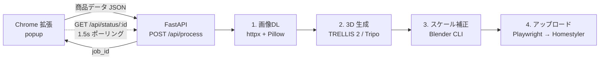

# EC3D-Bridge

ECサイトの商品ページから家具情報を抽出し、自動で 3D モデル化して Homestyler に登録する Chrome 拡張機能 + バックエンドです。

## アーキテクチャ



| ステップ | 実装 | 失敗時の挙動 |
|---|---|---|
| 1. 画像DL | `services/image_downloader.py` | 400px 未満や 404 をスキップして次の画像へ |
| 2. 3D生成 | `services/model_generator.py` | `USE_TRIPO` で TRELLIS / Tripo を切替 |
| 3. スケール補正 | `scripts/scale_model.py` (Blender) | 寸法 0 ならスキップして原本を返す |
| 4. アップロード | `services/homestyler_bot.py` | エラー時スクリーンショットを `logs/` に保存 |

## クイックスタート

### 1. バックエンド

```bash
cd backend
cp .env.example .env   # トークン類を埋める
pip install -r requirements.txt
python -m playwright install chromium
uvicorn main:app --host 0.0.0.0 --port 3000 --reload
```

`http://localhost:3000/health` で `{"status":"ok"}` が返れば起動成功。
依存コンポーネント (Blender / HF or fal.ai / Homestyler) の詳細状態は `/health/detail` で確認できます。

### 2. Chrome 拡張機能

1. `chrome://extensions/` を開く
2. 「デベロッパーモード」をON
3. 「パッケージ化されていない拡張機能を読み込む」→ `extension/` を選択

### 3. 使い方

対応 EC サイト (ニトリ・IKEA・MUJI・Amazon JP・楽天) の商品ページを開いて拡張機能アイコンをクリック → 「この商品を3D化 → Homestylerへ」。
進捗バーが 4 ステップを表示し、完了すると Homestyler の「マイモデル」に登録されます。

## 設定 (`.env`)

| 変数 | 説明 |
|---|---|
| `HF_TOKEN` | HuggingFace API トークン (TRELLIS 2 利用時) |
| `FAL_API_KEY` | fal.ai API キー (Tripo 利用時) |
| `USE_TRIPO` | `true` で Tripo (fal.ai)、`false`/未設定で TRELLIS 2 |
| `HOMESTYLER_EMAIL` / `HOMESTYLER_PASSWORD` | Homestyler ログイン認証情報 |
| `BLENDER_PATH` | Blender 実行ファイルへの絶対パス (default: `blender`) |
| `PORT` | サーバーポート (default: `3000`) |

## API

| メソッド | パス | 説明 |
|---|---|---|
| `GET` | `/health` | 軽量ヘルスチェック (常に 200) |
| `GET` | `/health/detail` | Blender / モデルプロバイダー / Homestyler の設定状態を返す |
| `POST` | `/api/process` | ジョブを作成し `{job_id}` を 202 で返す |
| `GET` | `/api/status/{job_id}` | ジョブの進捗・結果・エラーを返す |

### `POST /api/process` リクエスト例

```json
{
  "product_name": "ダイニングテーブル ノーチェ4",
  "source_url": "https://www.nitori-net.jp/ec/product/8120164/",
  "site": "nitori-net.jp",
  "dimensions": { "width_cm": 120, "depth_cm": 75, "height_cm": 72 },
  "colors": ["ナチュラル"],
  "materials": ["天然木", "オーク"],
  "images": [{ "url": "https://...", "type": "front" }],
  "category": "家具"
}
```

### `GET /api/status/{job_id}` レスポンス例

```json
{
  "id": "f774fdc1a99b",
  "product_name": "ダイニングテーブル ノーチェ4",
  "status": "running",
  "step": "generating_3d",
  "step_index": 2,
  "total_steps": 4,
  "message": "[2/4] 3Dモデルを生成しています...",
  "result": null,
  "error": null
}
```

`status` は `queued` / `running` / `success` / `error` のいずれか。
終端状態 (`success`/`error`) に達するまで popup は 1.5 秒間隔でポーリングします。

## 開発

### テスト

```bash
# バックエンド (pytest, 23テスト)
cd backend
pip install -r requirements-dev.txt
pytest tests/ -v

# 拡張機能 (node --test, 17テスト)
cd extension
npm install
npm test
```

CI (GitHub Actions) は PR ごとに上記を自動実行します。

### サイト追加 / セレクター修正

商品ページの HTML 構造が変わった場合は `extension/scrapers/site_configs.js` の該当ドメインのセレクターを更新してください。新サイトを追加する場合は以下を編集:

1. `extension/scrapers/site_configs.js` に CSS セレクターを追加
2. `extension/manifest.json` の `host_permissions` と `content_scripts.matches` にドメインを追加
3. `extension/tests/fixtures/<site>.html` にサンプルHTMLを置き、`tests/test_e2e_scraper.mjs` にケース追加

### ディレクトリ構成

```
backend/
  main.py                       # FastAPI エントリーポイント
  routers/process.py            # /api/process /api/status
  services/
    image_downloader.py         # 画像DL & Pillow検証
    model_generator.py          # TRELLIS / Tripo
    scale_correction.py         # Blender CLI 呼び出し
    homestyler_bot.py           # Playwright
    job_manager.py              # インメモリ Job ストア
    health_check.py             # /health/detail
    cleanup.py                  # output/ 古ファイル削除
  scripts/scale_model.py        # Blender ヘッドレススクリプト
  tests/                        # pytest スイート
extension/
  manifest.json
  popup/{index.html,popup.js}
  content_scripts/scraper.js
  scrapers/site_configs.js      # サイト別 CSS セレクター
  background/service_worker.js
  tests/{fixtures/, test_*.mjs} # node --test
.github/workflows/test.yml      # CI
```

## トラブルシューティング

| 症状 | 原因 | 対処 |
|---|---|---|
| popup が `connection refused` | バックエンド未起動 | `uvicorn main:app --port 3000` |
| `HF_TOKEN が .env に設定されていません` | トークン未設定 | `.env` に `HF_TOKEN=...` または `USE_TRIPO=true` & `FAL_API_KEY=...` |
| `Blenderスクリプトがエラーで終了` | Blender 未インストールまたはパス誤り | `blender --version` で確認、`.env` の `BLENDER_PATH` を修正 |
| `有効な商品画像が1枚もダウンロードできません` | 画像URLが古い or サーバー保護 | DevTools で画像 URL を確認し `site_configs.js` を更新 |
| `ログインフィールドが見つかりません` | Homestyler UI 変更 | `homestyler_bot.py` で `headless=False` にしてセレクターを確認・更新 |
| `商品名が取得できません` | 対応外サイト or セレクター崩れ | `site_configs.js` の該当サイトを DevTools で確認・修正 |

`/health/detail` を確認すると、どの依存が落ちているかを一目で把握できます。
